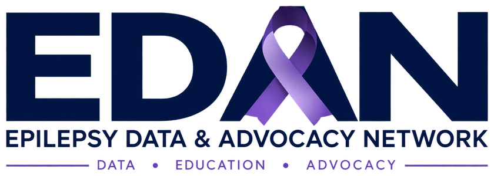

# { .edan-hero-logo }

*Public data, plain language, and free resources for Minnesotans with epilepsy and their
families. Student-led, free, and open.*

Someone having a seizure right now? [What to do, in four steps](now/index.md)

!!! tip "For school districts: the free Seizure-Safe Schools packet"
    Everything a district needs to meet Minnesota's seizure-safety law (Minn. Stat. 121A.24)
    in one 7-page PDF: a seizure action plan template, drop-in Policy 516 language, a
    printable first-aid poster, a seizure observation log, and an adoption checklist. Free to
    copy, adapt, and use.

    [Download the packet (PDF)](packet/EDAN-Seizure-Safe-Schools-Packet.pdf){ .md-button .md-button--primary download="EDAN-Seizure-Safe-Schools-Packet.pdf" }
    [How to put it into practice](chapters/08-for-schools-in-practice/index.md){ .md-button }

!!! quote "📣 In the news: Minnesota Star Tribune"
    EDAN founder Rishik Kondadadi's commentary, **["If a student had a seizure in the classroom, would your school be prepared?"](https://www.startribune.com/seizure-first-aid-training-mn-schools-epilepsy-awareness/601870213)**, ran in the *Minnesota Star Tribune* on July 23, 2026. It makes the case that more Minnesota schools should post seizure action plans where families can actually find them.

> **New here?** [Read about EDAN](about.md), what we do and why.

---

About 53,700 Minnesotans live with epilepsy, and most of what goes wrong for them is an
information problem: a school with no plan, a pharmacy that closed, a specialist three hours
away, a benefit nobody explained. EDAN is a student-led organization that uses public data to
find those gaps, translates what it finds into plain language, and puts free resources where
they help most. Then we count the people whose lives changed. Everything here is free.

!!! quote "What a school district told us"
    Your initial email that came in August was such a blessing! As I had been working through
    things, I had discovered that we (the district) did indeed have three students with seizure
    disorders and we had no formal plan in place, nor did I have the time to dedicate to finding
    what we would need on top of my other regular duties.

    With the help of your packet, I can say that we now have a plan in place for all students
    and that staff know what to do. I am grateful to you for all of the work you put into this
    packet! It is a wonderful resource and one that I plan to keep handy for reference in the
    future.

    *District staff member, a Minnesota public school district, September 2026. Shared with
    permission; name and district withheld.*

## Five initiatives for 2026-27
1. [Seizure-Safe Schools](initiatives/seizure-safe-schools.md): 7 in 10 Minnesota districts
   post no findable seizure plan. We are turning that finding into adoptions.
2. [The state's epilepsy data](initiatives/state-epilepsy-data.md): a 2025 law makes MDH
   count epilepsy every year. We are its first district-level data partner.
3. [Medication access](initiatives/medication-access.md): shortages, prices, pharmacy
   deserts, and a bill to cap what epilepsy drugs cost families.
4. [Distance to care](initiatives/care-access.md): 101 districts are more than 60 miles from
   a child neurologist. We mapped every one.
5. [SUDEP](initiatives/sudep.md): about 1,000 Minnesota deaths a year involve seizures and
   nobody counts SUDEP. Data, a missed benefit, and a reporting law.

[Read the full initiatives page](initiatives/index.md), including how we measure impact.

## Who this is for
- **Families** of children with epilepsy: your child's rights, everyday safety, support, and how
  to ask a school for a plan.
- **Teachers, school staff, and nurses:** clear seizure first aid, the Minnesota law, and a free
  drop-in packet.
- **Anyone affected by epilepsy** who wants plain-language information and recent research,
  translated.

## What makes this "intelligent"
- **Interactive MicroSims** let you practice, like the [Seizure First Aid Simulator](sims/seizure-first-aid/index.md).
- **Quizzes** at the end of key chapters check understanding (and can serve as the staff
  "self-study" the law asks for).
- A **glossary** translates clinical terms into plain English.

## Start here
- **A student with epilepsy yourself?** This page is for you: [For Students](for-students/index.md).
- New to epilepsy? Begin with [Understanding Epilepsy](chapters/01-understanding-epilepsy/index.md).
- Need to know what to do in a seizure right now? Go to [Seizure First Aid](chapters/02-seizure-first-aid/index.md).
- Want to check your own district? Use [Find Your District](find-your-district/index.md).
- A school ready to act? Earn the [Seizure-Smart Classroom badge](programs/seizure-smart-classroom/index.md).
- A student wanting to help? Run a [peer-awareness event](programs/peer-awareness/index.md).
- A parent wanting to know your child's rights? See [504 Plans, IEPs & Accommodations](chapters/07-your-childs-rights/index.md).
- A school putting a plan into practice? See [For Schools: In Practice](chapters/08-for-schools-in-practice/index.md).
- Want the research story and interactive charts? See [The Data: Mapping the Gaps](chapters/05-the-data-case-study/index.md).
- Living day to day with epilepsy? See [Everyday Safety & Living](chapters/09-everyday-safety/index.md).
- Looking for support, helplines, or financial help? See [Resources & Support](resources/index.md).
- Want recent research in plain language? See [Research, Translated](research-translated/index.md).
- Quick answers? See the [FAQ](faq.md).

!!! warning "Important"
    This textbook is informational and is not legal or medical advice. A child's seizure care
    must be set by their licensed healthcare provider. In an emergency, call 911.
