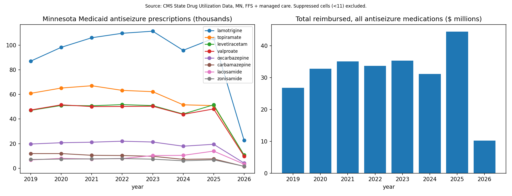
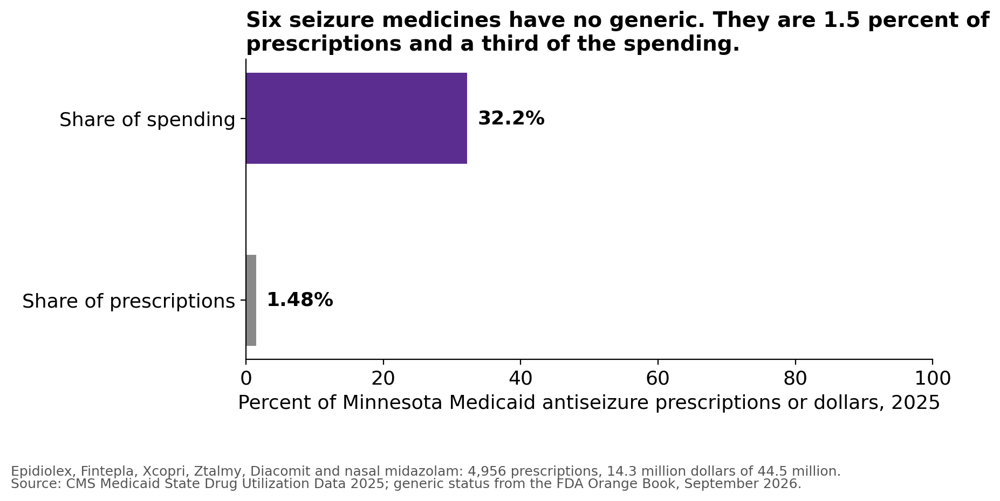
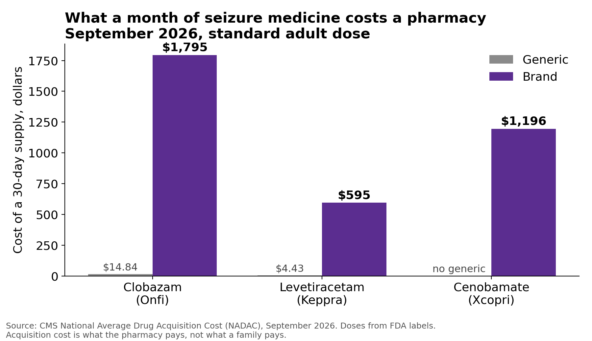

# 2. Medication access

Status: data published September 2026.

## The gap
For most conditions a missed dose is a nuisance. For epilepsy, going without medicine for a
stretch is what causes harm. In a study of 33,658 adults with epilepsy on Medicaid, the
periods when people were not taking their medicine carried about three times the death rate,
one and a half times the emergency visits, and twice the rate of injury-causing crashes
(Faught et al., Neurology 2008, PMID 18565827). A single forgotten dose is a different thing.
A 2026 study of adults with frequent, drug-resistant seizures found that an occasional missed
dose did not measurably raise seizure risk the next day (Goldenholz et al., Annals of
Neurology 2026); the authors still stress taking medicine as prescribed. Nationally, among
adults with active epilepsy, about 13 percent say
they could not afford their prescription and about 9 percent skip doses to save money. Adults
without epilepsy report about 6 percent on both of those questions (CDC, MMWR 2022;71(21),
survey years 2015 and 2017). Two other things stand between a Minnesota family and
the pill: supply problems (FDA lists discontinuations of several oral seizure products, and a
shortage of the hospital IV form of valproate open since 2020) and distance.
Minnesota has lost 13 percent of its community pharmacies since 2009, and about one in five
residents now lives in a low-access area.

## What the data shows
We pulled Minnesota Medicaid antiseizure prescriptions from 2019 through early 2026 from the
federal State Drug Utilization Data. CMS hides any cell under 11 prescriptions, so the totals
run slightly low, and gabapentin, pregabalin and clonazepam are left out because most of their
use is for other conditions. The 2026 figures cover only part of the year.

| 2025 | Value |
|---|---|
| Antiseizure prescriptions paid by Minnesota Medicaid | about 335,000 |
| Total reimbursed | $44 million |
| Average cost, lamotrigine (most common) | $24 per prescription |
| Average cost, nasal diazepam (Valtoco) | $1,444 |
| Average cost, cannabidiol (Epidiolex) | $3,739 |
| Average cost, vigabatrin | $13,724 |

Clobazam prescriptions fell 34 percent between the first and second quarters of 2024. We
first read that as a shortage, and we were wrong. We checked both national shortage trackers
as they stood during 2024, using archived snapshots of the FDA list and the ASHP list, and
neither recorded a clobazam shortage that year. The only clobazam entry anywhere is one
company discontinuing its 20 mg tablet. Fifteen other seizure medicines fell by a fifth or
more in the same quarter, and a shortage hits one drug at a time. Minnesota's Medicaid
renewals after the pandemic ran through mid-2024, which fits the pattern better. Medicaid
covers only part of the Minnesotans with epilepsy; commercial claims are held by MDH and we
have asked for them.

## What a Minnesota family actually pays

Medicaid prices are not what a working family sees. In September 2026 we pulled the federal
drug pricing file, checked which seizure medicines have a generic, priced ten real Minnesota
insurance plans, and read the state's own claims data. Four things stand out.

Six seizure medicines have no generic version: Epidiolex, Fintepla, Xcopri, Ztalmy,
Diacomit and nasal midazolam (Nayzilam). Other products, such as Valtoco nasal diazepam, have no
generic in their own form. In Minnesota Medicaid in 2025 the six were 1.5 percent
of seizure prescriptions and 32 percent of the spending, before manufacturer rebates.

Where a generic does exist, the gap is enormous. A month of generic clobazam costs a pharmacy
about $15. The brand, Onfi, costs about $1,795. Generic levetiracetam is $4.43 against $595
for Keppra. A controlled trial that switched adults between two very different generic
versions of lamotrigine found no detectable difference in drug levels or seizures (EQUIGEN,
Lancet Neurology 2016, PMID 26875743). A change in pill color between refills did make people
somewhat more likely to stop filling the prescription (Kesselheim et al., JAMA Internal
Medicine 2013, PMID 23277164).

Minnesotans on commercial insurance pay far more than people on public programs. From the
Minnesota All Payer Claims Database for 2022: $18.48 out of pocket per fill on a commercial
plan, against $9.30 on Medicare and $1.31 on Minnesota Health Care Programs (Medical Assistance and MinnesotaCare). For the expensive drugs the
median payment is $0.00 while the average runs from about $96 to $267 a fill, which is the
deductible pattern. Across a
year, commercial members taking fenfluramine paid $1,822 on average, eslicarbazepine $1,460,
and cannabidiol $1,073. Those three averages rest on small numbers of people, 12, 13 and 71
respectively, and the database holds roughly 40 percent of Minnesota's commercial market, so
read them as the shape of the problem rather than a statewide count.

Prices keep rising, and the state knows it. Minnesota's drug price transparency law requires
manufacturers to report large increases. The state's public files show at least 50 on seizure
drugs, effective 2022 to 2025; MDH withheld other reports over trade secret claims. Sabril rose about 15 percent in twelve months, to $20,182 for a bottle of 100
tablets. Onfi rose about 24 percent over three January increases. In each of the three annual
reports we tabulated, anticonvulsants were a top-ten class by number of price increase
filings, and the median two-year increase for the class went from 15 percent to 31 percent,
though the number of products behind that median also fell. The reasons manufacturers give are boilerplate, and in two cases the reason was
withheld as a trade secret.

Two 2026 bills (HF 3652 and SF 3786) would have added epilepsy to Minn. Stat. 62Q.481,
which since January 2025 has capped what a Minnesotan pays for diabetes, asthma and severe
allergy medicine at $25 a month, for plans that state law regulates. The Department of Commerce, using claims from 2021 to 2024, projects that people filling an
epilepsy drug will pay an average of $44.71 a month in cost sharing in 2027, with $17.35 of that above the $25
line. Spread across everyone with private coverage, the change costs about four cents per member
per month. Both bills died with this legislature and would need to be reintroduced
in 2027.

The Minnesota Department of Health ran the claims counts behind that estimate and shared them
with EDAN in September 2026. In 2024, 4,341 commercially insured Minnesotans with epilepsy
filled a seizure prescription. In 12 percent of the months they filled one, they paid more than
$25 per 30-day supply, by $55 on average. What they paid above $25 came to $385,732 that year.
Both measures have fallen since 2021, when 14.6 percent of months went over and the overage came
to $536,892. These counts come from the Minnesota All Payer Claims Database, which does not
receive claims from self-insured employer plans and holds about 40 percent of the commercial
market, so the true number of people affected is larger. MDH did not count how many different
people went over $25 in a year, only how many months did.

| | 2021 | 2022 | 2023 | 2024 |
|---|---:|---:|---:|---:|
| Members with an epilepsy diagnosis | 6,964 | 7,156 | 6,691 | 6,401 |
| Filled a seizure prescription | 4,630 | 4,749 | 4,434 | 4,341 |
| Months over $25 per 30-day supply | 14.6% | 13.7% | 13.4% | 12.0% |
| Patient cost sharing | $1.21M | $1.18M | $998K | $985K |
| Amount above $25 | $537K | $509K | $396K | $386K |

*Minnesota Department of Health, Health Economics Program, MN APCD Extract 29. Commercial members
with 12 months of medical and pharmacy coverage and an epilepsy or seizure diagnosis. "Months
over $25" is the share of months with a fill in which the patient paid more than $25 per 30-day
supply. Self-insured (ERISA) plans are not included.*

Sources: Minnesota Department of Health (All Payer Claims Database and prescription drug price
transparency reports); CMS National Average Drug Acquisition Cost; FDA Orange Book; 2026 plan
benefit summaries and formularies from HealthPartners, Medica, UCare and the State Employee
Group Insurance Program.

## Explore: which drugs, and what they cost
Click a drug name in the legend to show or hide it. The most common drugs are cheap generics.
The drugs a child with hard-to-control epilepsy needs are the expensive ones.

<iframe src="../../charts/asm_by_molecule.html" class="microsim" width="100%" height="540" title="Medicaid antiseizure prescriptions by drug" loading="lazy"></iframe>

<iframe src="../../charts/asm_cost_per_rx.html" class="microsim" width="100%" height="700" title="Cost per prescription by drug" loading="lazy"></iframe>

## Check yourself
??? quiz "1. Six seizure medicines have no generic. What share of Minnesota Medicaid seizure-drug spending did they take in 2025?"
    About 32 percent, before manufacturer rebates, while making up 1.5 percent of the
    prescriptions.

??? quiz "2. In 2024, in what share of months did commercially insured Minnesotans filling a seizure prescription pay more than $25?"
    12 percent, down from 14.6 percent in 2021, in the All Payer Claims Database counts MDH
    ran for EDAN. The database leaves out self-insured employer plans.

??? quiz "3. Why does a broad drop across many drugs in one quarter probably not mean a shortage?"
    Shortages hit one molecule. A drop across unrelated drugs at once points to fewer people
    enrolled or late reporting. In 2024 Minnesota's Medicaid renewals fit that pattern.

## What we are doing this year
- Keeping this dashboard current each quarter and flagging shortage signals.
- Mapping distance from every school district to the nearest retail pharmacy. First pass,
  September 2026: 15 districts are more than 15 miles from any retail pharmacy, and 14 of
  those also post no findable seizure plan. Grygla, Red Lake, Floodwood, and Nett Lake are
  farthest. Look up any district in the [Distance to Care Lookup](../sims/distance-lookup/index.md).
- Supporting reintroduction of the HF 3652 / SF 3786 cap in the 2027 session. It would limit
  what a patient pays for epilepsy drugs to $25 a month in state-regulated plans, the same
  protection diabetes and asthma already have. Actuaries from Actuarial Research
  Corporation, in an evaluation done for the Department of Commerce, priced it at four cents per
  member per month.
  Students are ready to testify when a new bill is heard.

## Who uses this data
The cost and claims numbers on this page are meant for the legislators carrying the cost-sharing cap
and for the Epilepsy Foundation of Minnesota. Families who need help paying for medicine now
should contact the [Epilepsy Foundation of Minnesota](https://www.epilepsyfoundationmn.org/).
