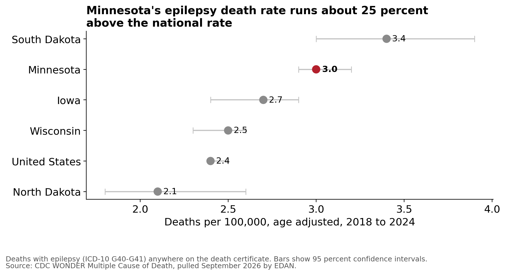

# 3. SUDEP

Status: started September 2026. This page is student-written from
public sources and have not yet been reviewed by a clinician or the Epilepsy Foundation of
Minnesota; we are seeking that review. Nothing here is medical advice.

## The gap
Sudden Unexpected Death in Epilepsy is rare, about one in a thousand adults with epilepsy a
year and lower in children (American Academy of Neurology guideline, Harden et al. 2017), and
it is the outcome every family fears. The Minnesota
Department of Health reports around 1,000 deaths a year in the state related to epilepsy or
seizures; our own pull of 2018 to 2024 death certificates gives about 870 a year that mention
epilepsy or seizures, and about 200 a year that mention epilepsy specifically. How many are SUDEP, nobody knows: it has no diagnostic code, and death certificates
record it as "epilepsy" or "undetermined." Illinois, New Jersey, and North Carolina require
medical examiners to look for it and report it. Minnesota does not.

Since January 2024 Minnesota Medical Assistance has covered seizure detection devices,
wearables that alert a caregiver to a convulsive seizure. Minnesota was the first state to do
this. Nobody has published how many families use it.

## What the death data shows
We pulled every Minnesota death certificate from 2018 to 2024 that mentions epilepsy or
seizures, from the CDC's multiple cause of death files.

<iframe src="../../charts/mortality_by_year.html" class="microsim" width="100%" height="480" title="Minnesota deaths mentioning epilepsy or seizures by year" loading="lazy"></iframe>

| 2018 to 2024, Minnesota residents | Deaths | Per year |
|---|---|---|
| Any mention of epilepsy or seizures on the certificate (G40, G41, R56) | 6,077 | about 870 |
| Any mention of epilepsy (G40, G41) | 1,404 | about 200 |
| Epilepsy as the underlying cause of death | 415 | about 60 |

The two broader counts rose across the seven years, from 728 to 967 for any seizure mention
and from 153 to 233 for any epilepsy mention. Deaths with epilepsy as the underlying cause
did not trend up, going from 60 in 2018 to 55 in 2024. Rates are low through childhood, rise steadily through adulthood,
and climb steeply after 65, when seizures ride along with strokes, dementia, and other
conditions. The epilepsy-specific count peaks at ages 65 to 74.

<iframe src="../../charts/mortality_by_age.html" class="microsim" width="100%" height="480" title="Rate by age" loading="lazy"></iframe>

SUDEP is inside the epilepsy count and cannot be separated from it. That is the whole
problem. Only 27 of 87 counties had enough epilepsy-specific deaths in seven years to
report a number at all. Fifty-seven are suppressed as fewer than 10, and three had none
recorded. Those are
the same counties with the smallest districts, the longest ambulance runs, and the farthest
specialists. Source: CDC WONDER, Multiple Cause of Death, 2018 to 2024.

## Where these deaths happen, and how Minnesota compares

SUDEP usually happens at home, often during sleep, and often with nobody present. Death
certificates almost never say so. The closest public measure is where people died, and for
younger Minnesotans that pattern is stark.

| Minnesota, 2018 to 2024 | Died at home | Total |
|---|---|---|
| Epilepsy mentioned anywhere on the certificate, all ages | 458 (33%) | 1,404 |
| Epilepsy mentioned anywhere, ages 1 to 44 | 169 (54%) | 311 |
| Epilepsy as the underlying cause, ages 1 to 44 | 98 (64%) | 152 |

Nearly two in three young Minnesotans whose deaths were caused by epilepsy died at home. That
is the population where SUDEP is most likely and least likely to be recorded as such. It is a
proxy, not a count: dying at home is not proof of SUDEP, and some SUDEP deaths happen
elsewhere.

Minnesota's epilepsy death rate also runs above the national one. Counting every death
certificate that mentions epilepsy anywhere, not only those where it was the underlying cause,
Minnesota's age-adjusted rate for 2018 to 2024 is 3.0 per 100,000 against 2.4 nationally,
about 25 percent higher. Minnesota is clearly above Wisconsin, North Dakota and the United
States. Iowa is marginal, since its interval touches ours at 2.9. South Dakota is the only
neighbor with a higher estimate, 3.4, and its interval overlaps ours, so we cannot say the two
states differ.

One caution before reading too much into that gap. A state's rate depends partly on how often
doctors write epilepsy on a death certificate, which varies. A higher rate may mean more
deaths, better recording, or both. Source: CDC WONDER, Multiple Cause of Death, 2018 to 2024.

## What we are doing this year
- A public-records request to find out how many devices Medical Assistance has covered, so
  the benefit can be measured.
- Keeping the death analysis above current each year as CDC releases data, and adding
  regional groupings so rural rates can be shown without breaking suppression rules.
- A draft Minnesota SUDEP investigation and reporting law, modeled on Illinois, for the
  Epilepsy Foundation of Minnesota and the authors of the 2025 epilepsy program law. Its
  data would feed the mortality count the state is now required to publish.

## Who uses this data
The death counts and device claims are meant for the Epilepsy Foundation of Minnesota, the Danny Did
Foundation and the legislators who wrote the 2025 epilepsy program law. Families with
questions about SUDEP or seizure alert devices can reach the
[Epilepsy Foundation of Minnesota](https://www.epilepsyfoundationmn.org/) or the
[Danny Did Foundation](https://www.dannydid.org/).

!!! note
    Questions about your own or your child's risk belong with your neurologist. This page
    publishes what the public data shows and what Minnesota does not currently record.
