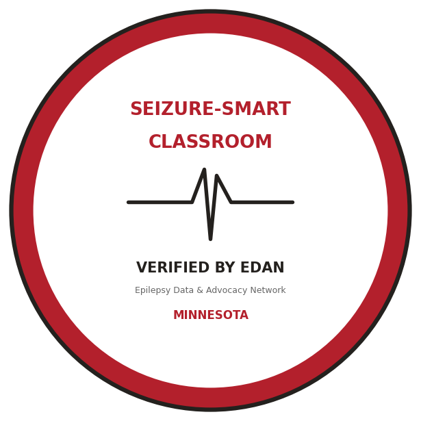

# Seizure-Smart Classroom

**A free recognition program for Minnesota schools.** Complete a short checklist, confirm it with
EDAN, and earn the Seizure-Smart Classroom badge to display on your website and in your health
office, public proof that your school is ready to keep students with epilepsy safe.

It is free, takes the work you may already be doing under Minn. Stat. 121A.24, and turns it into
something families can see and trust.

## How to earn the badge
A school (or building) earns Seizure-Smart status by confirming all five steps. Our free
[district packet](../../chapters/06-how-to-help/index.md) gives you everything for each one.

1. **Post a seizure action plan template** on your public health-services page so families can find
   and complete it (offer translations where possible).
2. **Have a seizure policy** that reflects Minn. Stat. 121A.24 (our drop-in Policy 516 language
   works), or confirm one is in your board policies.
3. **Name a trained responder at each building**, a nurse or a designated, trained staff member on
   duty during the school day.
4. **Train staff** with the free [Epilepsy Foundation seizure training](https://www.epilepsy.com/programs/training-education)
   for the people who work with students.
5. **Post the seizure first-aid poster** in health offices and staff rooms.

## How to get recognized
1. Complete the five steps above (the [packet](../../packet/EDAN-Seizure-Safe-Schools-Packet.pdf)
   has the template, policy language, and poster).
2. **Email us at edanmnorg@gmail.com** from a school address, confirming the five steps and linking
   your posted seizure action plan.
3. We verify (mostly by checking your posted plan) and send you the **Seizure-Smart Classroom
   badge** to display, plus we add your school to our public list below.

It is a self-attestation program: you confirm the steps, we verify what's public, and the
recognition reflects your good work. Renew yearly so your plan stays current.

## The badge
{ width="260" }

Awarded after we confirm your checklist. Display it on your health-services page, in newsletters,
or in the health office.

## Participating schools
*Be the first.* As schools earn the badge, we will list them here so families can see who is
Seizure-Smart. If your school has completed the steps, [email us](mailto:edanmnorg@gmail.com).

---
*Free, student-led, and run by the Epilepsy Data & Advocacy Network (EDAN). Recognition reflects
self-reported completion plus public verification of a posted plan; it is not a legal
certification of compliance. Questions: edanmnorg@gmail.com.*
